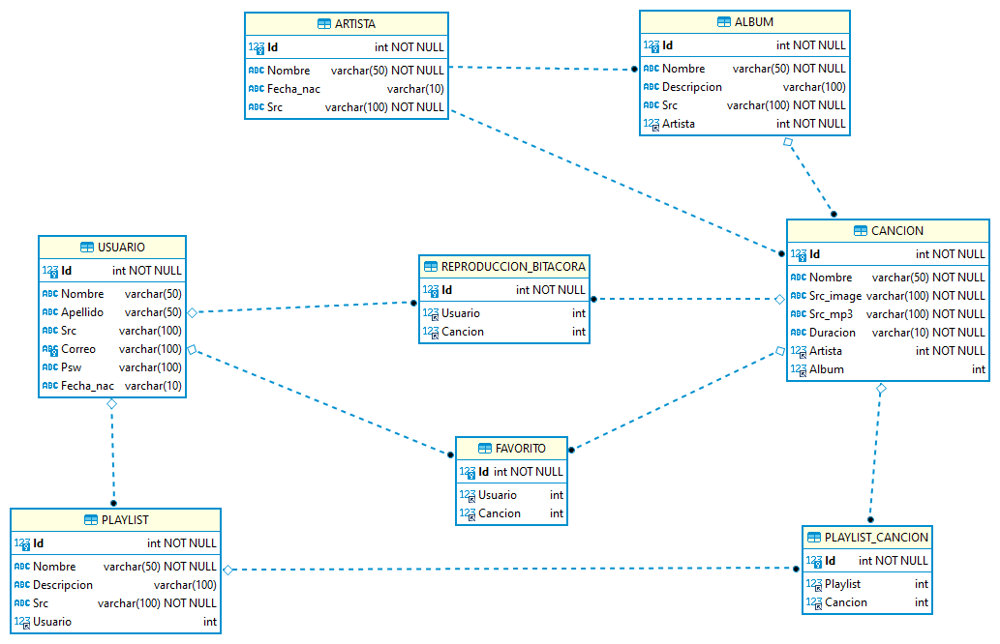
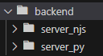
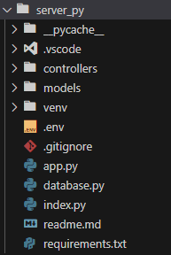
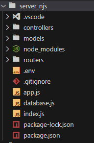
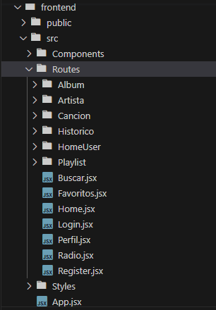

# Manual de Técnico
Este manual técnico proporciona una visión detallada de la arquitectura y la configuración técnica que respalda el funcionamiento interno de nuestra aplicación. La arquitectura se ha diseñado cuidadosamente utilizando servicios de AWS (Amazon Web Services) para garantizar un rendimiento óptimo, escalabilidad y seguridad. A lo largo de este manual, se describirán los componentes clave que forman parte de esta arquitectura y se brindarán instrucciones detalladas sobre su configuración y funcionamiento.

## Arquitectura
.png)

- **S3 (Amazon Simple Storage Service):** Nuestra aplicación se encuentra alojada en un bucket de S3, funcionando como un sitio web estático. Además, utilizamos otro bucket para almacenar archivos MP3 y imágenes de perfil, artistas, álbumes y listas de reproducción. Esto se configura con políticas públicas para garantizar el acceso desde la aplicación.

- **EC2 (Amazon Elastic Compute Cloud):** Contamos con dos instancias de EC2 que albergan servidores con rutas idénticas de la aplicación. Esto permite la integración con nuestro balanceador de carga. Los servidores se ejecutan en NODEJS y PYTHON, y se configuran para permitir solo los puertos necesarios según los grupos de seguridad.

- **Load Balancer (Balanceador de Carga):** se configuro un balanceador de carga que verifica el estado de las dos instancias de EC2 y redirige las solicitudes de la aplicación al servidor disponible. Es importante destacar que la aplicación consume el balanceador de carga, no las instancias de EC2 directamente.

- **RDS:** se utilizó una instancia de RDS para la base de datos desarrollada en MySQL. En lugar de guardar archivos e imágenes de usuarios, se guarda la URL de su ubicación en la base de datos.

- **IAM (Identity and Access Management):** se crearon usuarios de IAM para EC2, RDS, el balanceador de carga y S3 según fuera necesario para el manejo y uso de los servicios de AWS, cada uno con sus políticas asociadas.

## Digrama Entidad-Relación


## Estructura del proyecto
### Backend
El backend se encuentra divido en dos servicios, uno desarrollado en NodeJS y otro en Python. El servicio de NodeJS contiene las mismas rutas y funcionalidades que el servidor de Python. A continuación, se muestra la estructura de carpetas del backend:



Ambos servicios se encuentran alojados en instancias de EC2, las cuales se encuentran detrás de un balanceador de carga. El balanceador de carga se encarga de redirigir las peticiones a las instancias de EC2 disponibles. Ambos utilizan el modelo de arquitectura MVC (Modelo-Vista-Controlador). Como se puede ver a continuación:

NodeJS arquitectura MVC



Python arquitectura MVC



Para ambos casos se debe tener instalado NodeJS y Python respectivamente.

Para levantar el proyecto de NodeJS basta con ejecutar el comando `npm run dev` en la carpeta del proyecto. 

Para el caso de Python se debe seguir la siguientes instrucciones:

Crear el entorno virtual: venv

con el comando

```
python -m venv venv
```

Activar el entorno virtual

```
.\venv\Scripts\activate  
```

Ya activado el entorno, extraer librerías si es que existe el requirements.txt

```
pip install -r requirements.txt
```

En el caso no exista o se quieran actualizar las librerías el requirements.txt utilizar:

```
pip freeze > requirements.txt
```

Y por último para apagar el entorno.
```
deactivate
```

### Frontend
Desarrollado en Angular 16, el frontend de nuestra aplicación se divide en varias componentes principalmente en: **Sidebar**, **SidebarAdmin**. Cada uno de estos componentes se divide en subcomponentes que se encargan de mostrar la información de la aplicación. A continuación, se muestra la estructura de carpetas del frontend:

Estructura principal de carpetas del frontend


## Funcionalidades desarrolladas y división de tareas
### Funcionalidades
Estados

[ ] Pendiente

[x] Terminado

### Landing Page (*Angel)

- [x] Landing Page, navbar y pie de página

### Registro (*Angel *Alexis)

- [x] Registrar un nuevo usuario

### Login (*Angel *Diego *Alexis)

- [x] Inicio de sesión *Angel *Diego
- [x] Encriptación y comparación de contraseña *Alexis

### Administrador (*Estuardo *Alexis)

- [x] CRUD Artista, álbum y canción 
- [x] Página principal
- [x] Listado de canciones, álbumes y artistas
- [x] Reproductor de música

### Barra de Navegación (*Estuardo *Alexis *Diego)

- [x] Inicio *Estuardo *Alexis
- [x] Buscar *Estuardo *Alexis
- [x] Perfil *Estuardo *Diego

### Ver Datos (*Estuardo *Diego)

- [x] Editar datos

### Playlist (*Estuardo *Diego)

- [x] CRUD de playlist.
- [x] Agregar y eliminar canciones en playlist.
- [x] Reproducir canciones.

### Favoritos (*Angel *Diego)

- [x] Listado de canciones favoritas

### Histórico (*Estuardo *Diego)

- [x] Top 5 canciones más reproducidas.
- [x] Top 3 artistas más escuchados.
- [x] Top 5 álbumes más reproducidos.
- [x] Historial de canciones reproducidas.

### Radio (*Estuardo *Alexis)

- [x] Reproducción aleatoria de canciones