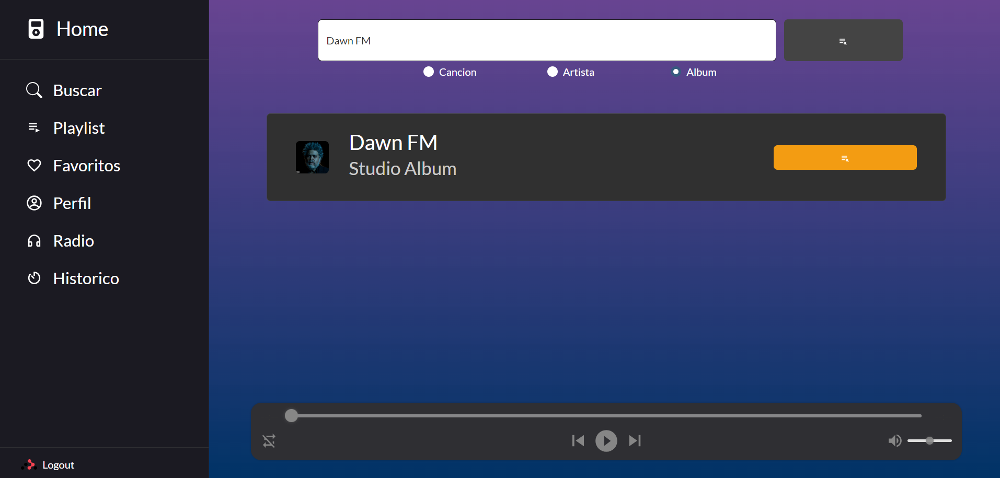
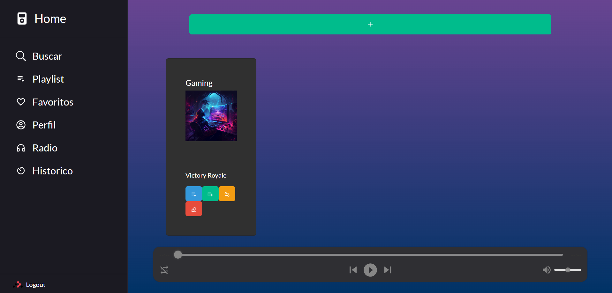
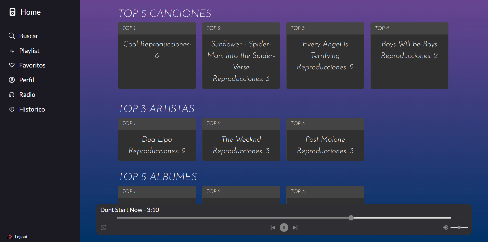

# Manual de Usuario

Este manual tiene como objetivos brindar la información y pasos necesarios para el correcto uso de la aplicación tanto para el administrador como usuarios, además de mostrar las distintas vistas y funciones que posee la aplicación.

La aplicacion cuenta con tres apartados principales los cuales son la Homepage, el apartado de administracion y el apartado de usuario.

## **Homepage**

En la Homepage se puede observar una barra de navegacion en la parte superior, el cual cuenta con las siguientes opciones:

- **Iniciar Sesion**: Esta opcion permite al usuario iniciar sesion en la aplicacion por medio del correo, para poder acceder a las funcionalidades de la misma.

- **Registrarse**: Esta opcion permite al usuario registrarse en la aplicacion, para poder acceder a las funcionalidades de la misma.

## **Administrador**

### **Vista Principal**  
El administrador nomas ingrese a la aplicación tendra una vista de algunas canciones, albumes y artistas, así mismo a la izquierda podra observar las distintas opciones disponibles, junto a las 3 exclusivas de su usuario:

- CRUD Canción
- CRUD Artista
- CRUD Album

### **CRUD Artista**  
En esta pestaña se pueden realizar las funcionalidades del CRUD para los artistas

#### **Funcionalidades**

- **Buscar (Botón Gris)**: Se debe ingresar el ID del artista seleccionado, esto filtra la lista y muestra solo al artista correspondiente

- **Create (Botón Azul con símbolo + )**: Redirije a una nueva vista en la cual se pueden ingresar los datos e imagen del nuevo artista:

Los artistas ya existentes aprecen en una lista con tres botones:
- **Ver (Botón Celeste):** Expande la imagen del artista junto con información adicional.

- **Update (Botón Amarillo):** Redirije a una nueva vista en la cual se pueden actualizar la foto y datos del artista seleccionado.

- **Delete (Botón Rojo):** Elimina al artista seleccionado.

### **CRUD Álbum**  
En esta pestaña se pueden realizar las funcionalidades del CRUD para los álbumes

#### **Funcionalidades**

- **Buscar (Botón Gris)**: Se debe ingresar el ID del álbum seleccionado, esto filtra la lista y muestra solo el álbum correspondiente

- **Create (Botón Azul con símbolo + )**: Redirije a una nueva vista en la cual se pueden ingresar los datos e imagen del nuevo álbum, además muestra una lista desplegable con los artistas existente:

Los álbumes ya existentes aprecen en una lista con cuatro botones:
- **Ver (Botón Celeste):** Muestra una lista con las canciones del álbum junto con la opción de quitarlas

- **Verde (Agregar Canciones)**: Nos muestra una lista de canciones disponibles del artista que no pertenecen a algun álbum junto a la opción de agregarla.

- **Update (Botón Amarillo):** Redirije a una nueva vista en la cual se pueden actualizar la foto y datos del álbum seleccionado.

- **Delete (Botón Rojo):** Elimina el álbum seleccionado.

### **CRUD Canción**  
En esta pestaña se pueden realizar las funcionalidades del CRUD para las canciones

#### **Funcionalidades**

- **Buscar (Botón Gris)**: Se debe ingresar el ID de la canción seleccionado, esto filtra la lista y muestra solo la canción correspondiente

- **Create (Botón Azul con símbolo + )**: Redirije a una nueva vista en la cual se pueden ingresar los datos e imagen de la nueva canción, además muestra una lista desplegable con los artistas y álbumes existentes:

Las canciones ya existentes aprecen en una lista con 2 botones:

- **Update (Botón Amarillo):** Redirije a una nueva vista en la cual se pueden actualizar la foto y datos de la canción seleccionada.

- **Delete (Botón Rojo):** Elimina la canción correspondiente.

## **User**

### **Vista Principal**  
El Usuario nada más ingrese a la aplicación tendra una vista de algunas canciones, albumes y artistas, así mismo a la izquierda podra observar las distintas opciones disponibles:

- Buscar
- Playlist
- Favoritos
- Perfil
- Radio
- Historico

### **Buscar**
Permite Buscar canciones, artistas o álbumes, para ello se debe escribir lo que se desaea buscar seleccionar que tipo de busqueda se realizara y presionar el botón.

- **Canción**: Nos muestra la canción correspondiente junto a la opción de reproducir, marcar como favorito o agregar a una playlist. 

- **Album**: con esta busqueda se obtiene el álbum junto con una opción para ver sus canciones, en donde se podra reproducir, marcar como favorito o agregar a una playlist.

- **Artista**: con esta busqueda se obtiene al artista junto con una opción para ver sus canciones, en donde se podra reproducir, marcar como favorito o agregar a una playlist.

### **Playlist**
En esta vista se podra crear una playlist en la cual agregar multiples canciones, además de poder editar su información o eliminarlas.

- **Crear:** Se solicita nombre, descripción y una imagen.

- **Agregar Canción:** Al seleccionar el botón de agregar se desplegara una lista con todas las canciones y agregar las deseadas.

- **Reproducir:** Al seleccionar la opción se abrira una lista con las canciones y un boton con el cual se reproduciran todas las canciones de la playlist.

### **Favoritos**
Muestra una lista de todas las canciones marcadas como favorito por el usuario, junto con el artista y álbum al que perteneces, así como la opción de reproducir y eliminar de favoritos.

### **Perfil**
Despliega la información del usuario y ofrece la capacidad de actualizar los datos de este.

### **Radio**
Nos muestra la imagen de la canción que se esta reproduciendo y reproduce todas las cancines disponibles.

### **Historico**
Nos muestra El top 5 canciones, top 3 artistas, top 5 álbumes con sus reproducciones cada uno, además nos muestra un historial de las últimas canciones reproducidas

